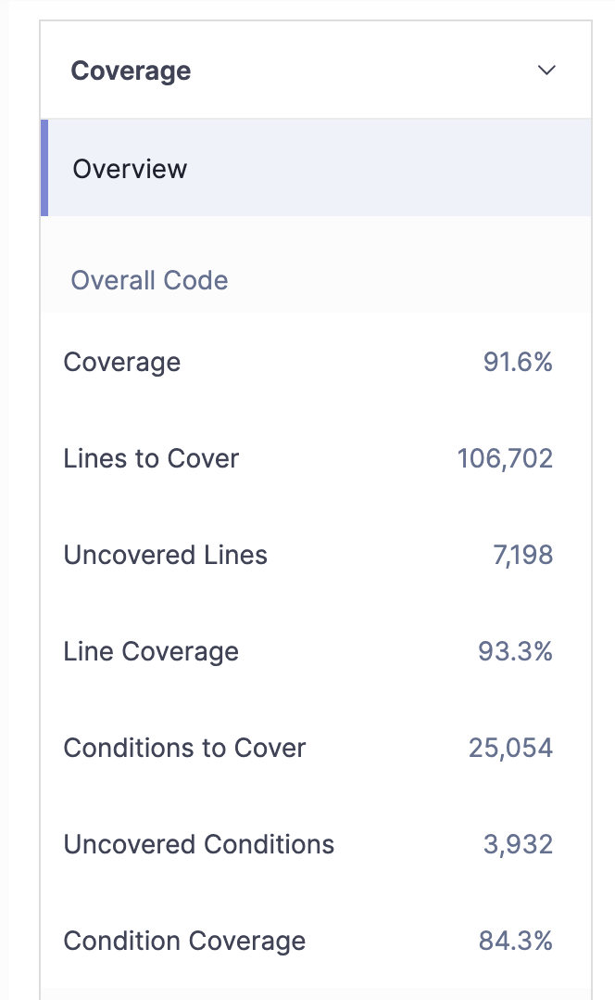
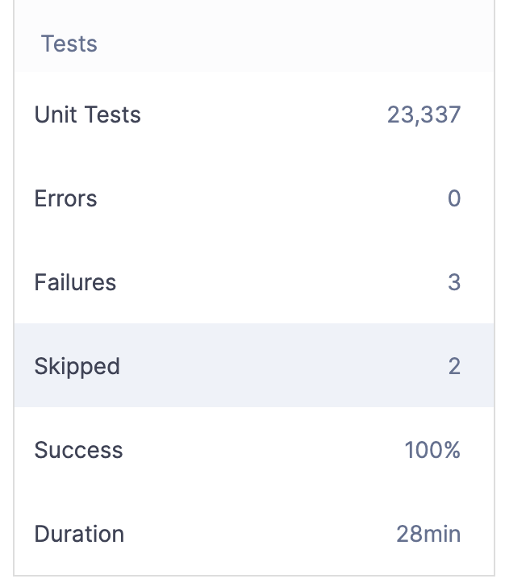

# Environment Setup

## Test Suite Summary

As previously discovered, SonarQube uses Gradle, JUnit, and Mockito for their unit and integration
tests. Jacoco is used to generate reports into the build directory for each subsystem. SonarQube
relies on JDK 17 and works best with Gradle 7. The authors have been working with Java 22 and Gradle 9,
but were able to install Gradle 7 and run the existing test suite. The `jacocoAggregateReport` Gradle
plugin was added to the `build.gradle` file to compile a comprehensive coverage report.

## Baseline Jacoco Coverage Metrics

* The Jacoco report captured a total 295,170 lines (statements). 135,616 were missed, resulting in
  45.95% statement coverage.
* Out of 106,641 if/switch statements (branches), 67,352 were missed, resulting in about 36%
  branch coverage.

*Note: the values above are derived from the Jacoco coverage report, which provides details on
various aspects of the test suite, including coverage, cyclomatic complexity, and more. The
definition of each column of the report can be found in the [Jacoco documentation][jacoco_docs].

[jacoco_docs]: https://www.eclemma.org/jacoco/trunk/doc/counters.html

## SonarQube Analysis

Coverage Output

Contrary to previous findings, SonarQube's analysis of itself shows different metrics. The report
shows 23,337 tests run, with 3 failures and 2 skipped.

* This report shows 106,702 lines. The authors believe this may result from test and config files
  being exluded from analysis. 7,198 lines were not covered, resulting in 93.3% coverage.
* The condition (assumed branch) coverage report shows 25,054 branches, with 3,932 branches not
  covered or 84.3% branch coverage.
* Total coverage results are evaluated as 91.6%.

These tests appear to be a mix of unit and integration (`IT`) tests. The UI appears that it may be
tested, given the presence of markdown conversion to HTML. However, these tests only seem to test
the generated HTML format and not from an interactive standpoint.
