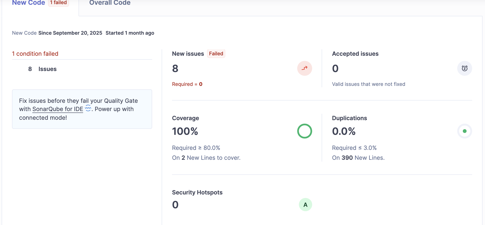
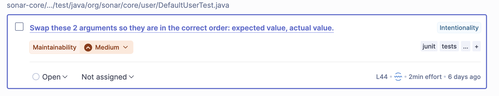
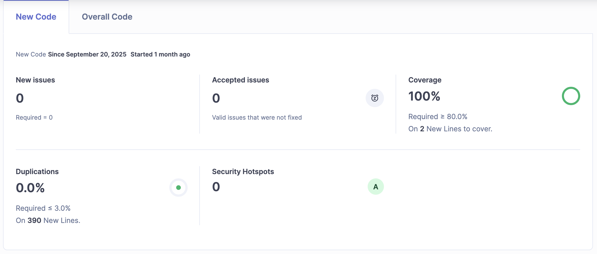

# Static Analysis Report

We (unsurprisingly) have been using an instance of SonarQube Server in a Docker container to
continually monitor the quality of changes that we have made to the tests in the SonarQube source
repository. As a result, we've largely been able to focus on our introduced issues, although there
are quite a few existing issues from the SonarQube repository itself. However, with a multi-module
project of this scale, it does not seem surprising that there would be a large rate of issues
tracked, especially when accounting for (what appears to be) an internal migration from JUnit4 to
JUnit 5.

## Initial Analysis Report

As mentioned in previous reports, the build pipeline can be summarized in the following command:

```bash
# MacOS
./gradlew clean build test jacocoTestReport sonar # optional sonar properties as CLI args
```

We use `clean`, `build`, and `test` to safely build and execute the test suites in the project. The
`jacocoTestReport` step generates the coverage files to be parsed by the `sonar` command, which
feeds the results to the containerized server for analysis. Results are stored in a PostgreSQL
container for continuous issue tracking.

The results of our [most recent assignment](../Mutation-Testing/)'s commit can be seen below.



## Changes and Final Report

It turns out that we made a mistake in our assertion statement ordering, putting the actual output
value before the expected value. Convention dictates that this should be reversed.



This required only a simple update in the test file. The results of this new commit are as follows:



## Group Contributions

| Member | Task/Contribution | Notes |
|--------|-------------------|-------|
| Andrew | Create report | Initial writeup of changes and collected supporting images |
|        | Implement changes | Completed suggested SQ changes |
| Christian | Analyze report findings and implement | Reviewed SonarQube report and wrote suggested changes |
