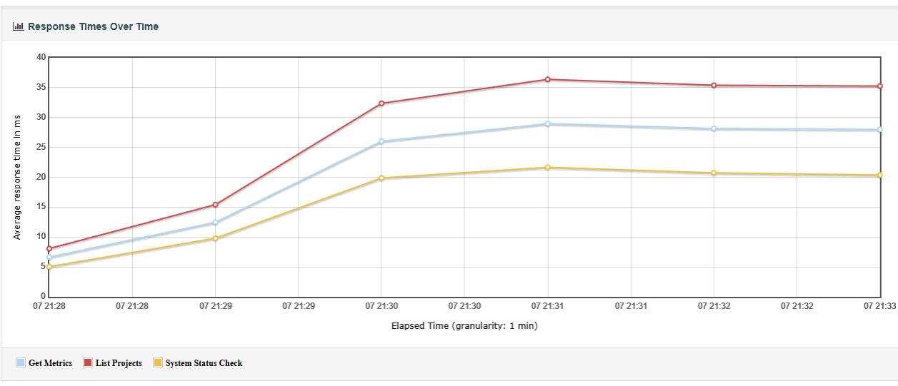
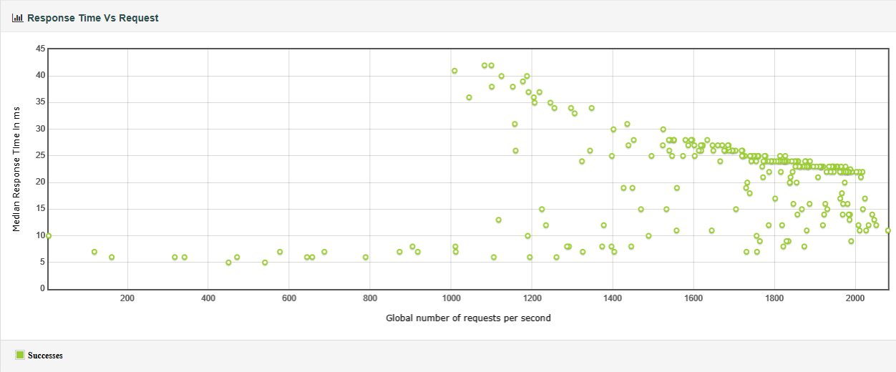
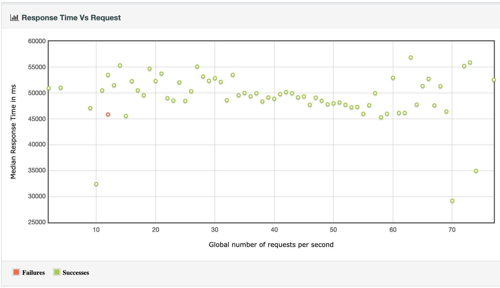

# Performance Testing Report

## Test Scope and Design

To test the application, we decided to see how well the Sonar Web API is able to handle an
increasing number of users.
Using JMeter, we are able to simulate an increasing number of users
(or, more likely, CI agents) making HTTP requests to the SonarQube server.

For load testing, we focused on making GET HTTP requests to retrieve project information.
We had each of the users request information on the system status, list of projects,
and metrics for a specific project.
For stress testing, we focused on making POST HTTP requests with unique project names.
We had each of the users create the test and then attempt to delete it.

## Configuration

System/project information tests:
With JMeter, we created a test plan that simulated a set of users making GET requests to
the SonarQube Web API.
This test ran for 50 users, with a ramp-up time of 120 seconds, and looped for 5 minutes.
This would simulate a gradual increase in load on the server over time.

Creation/deletion tests:
With JMeter, we used a script (assistance from ChatGPT) to create project names from a Java UUID.
We ran this for 2,000 users to send POST requests to the create and delete project endpoints.
The ramp-up time was 0 seconds, and this process looped 10 times.

## Results

System/Project Information Over time

System/Project Information Response Time v. Number of requests

Create/Delete Responses Over time

Create/Delete Response Time v. Number of requests

## Performance Findings

The load tests showed that the SonarQube server was able to handle an increasing number of
simultaneous GET requests fairly well. Response times remained relatively stable,
clustering at a peak response time around 35-40 milliseconds, despite the fact that over
500,000 requests were made during the test's 5-minute duration.

We found that, predictably, POST and DELETE requests took significantly longer to perform than GETs.
It seems thats, overall, the application handled the increased
load fairly well, given that project creation and delete seems to be a far less likely scenario than
checking on the status of current projects.
It is unclear if some of the performance bottlenecks come from JMeter itself, since
creating a large number of threads initially causes the program to run out of memory.

## Group Contributions

| Member    | Task/Contribution       | Notes                       |
|-----------|-------------------------|-----------------------------|
| Andrew    | JMeter test plan creation | Create and configure JMeter test plans for load testing |
|           | JMeter Gradle integration | Make Gradle tasks for running JMeter tests |
|           | README documentation      | Write README instructions for performance testing |
| Christian | Creation/Deletion Test Scenario | Create test plan to stress app; reports |
