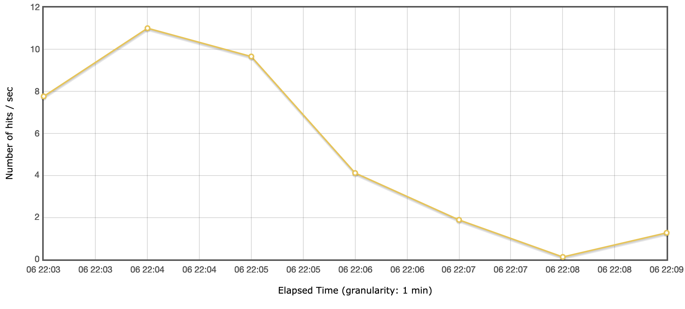

# Performance Testing Report

## Test Scope and Design

[Specify components, endpoints or user flows tested and what tool(s) were used.]

To stress test the application, we decided to see how well the Sonar Web API is able to handle an
increasing number of users. Using JMeter, we are able to simulate an increasing number of users (or,
more likely, CI agents) making POST HTTP requests with unique project names. We had each of the
users create the test and then attempt to delete it.

## Configuration

[Environment setup for the tests, like simulated users/requests, test duration, ramp-up, etc.]

Creation/deletion tests:
With JMeter, we used a script (assitance from ChatGPT) to create project names from a Java UUID.
We ran this for 1,000 users to send POST requests to the create and delete project endpoints. The
ramp-up time was 120 seconds.

## Results

[Metrics reports and/or screenshots from the performance testing tool.
Track response times, throughput, CPU/memory usage, etc.]

Create/Delete Responses Over time

Create/Delete Hits per Second

## Performance Findings

[Summary of key findings (e.g. bottlenecks, CPU/memory spikes, timeouts, etc.)]

We found that, predictably, POST and DELETE requests took significantly longer to perform than GETs.
It seems thats, overall, the application handled the increased load fairly well, given that project
creation and delete seems to be a far less likely scenario than checking on the status of current
projects. It is unclear if some of the performance bottlenecks come from JMeter itself, since
creating a large number of threads initially causes the program to run out of memory.

## Group Contributions

| Member    | Task/Contribution       | Notes                       |
|-----------|-------------------------|-----------------------------|
| Andrew    | Document scaffolding    |                             |
|           | JMeter test plan creation | Create and configure JMeter test plans for load testing |
|           | JMeter Gradle integration | Make a Gradle task for running JMeter tests |
|           | README documentation     | Write README instructions for performance testing |
| Christian | Creation/Deletion Test Scenario | Create test plan to stress app; reports |
