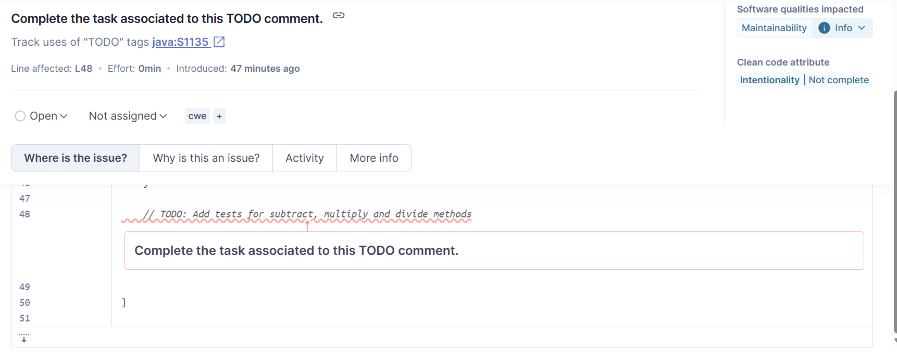
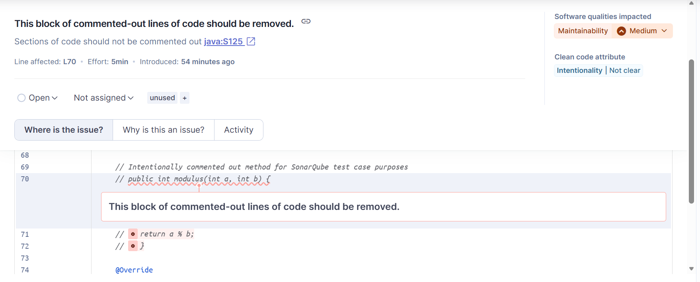

# System Testing Report

## Test Case Summary

### Test Case 1: Detect-TODO

Preconditions:

- A local SonarQube server is set up and running.
- The `dummy-project` is configured for SonarQube analysis.
- An analyzed file contains a comment prefixed with "TODO".

Example:

```java
// TODO: Refactor this method to do X
```

Test Steps:

1. Navigate to the `dummy-project` directory.
2. Run the Gradle command to build, test, and analyze the project with SonarQube.
3. Access the SonarQube dashboard.
4. Locate the analyzed file in the dashboard.

Expected Results:

- The SonarQube dashboard displays an issue for the TODO comment,
categorized as a code smell.
- The offending line is highlighted in the dashboard.

### Test Case 2: Detect-Commented-Out-Code

Preconditions:

- A local SonarQube server is set up and running.
- The `dummy-project` is configured for SonarQube analysis.
- An analyzed file contains commented-out code.
- Example:

```java
// public void unusedMethod() {
//    System.out.println("This method is commented out");
// }
```

Test Steps:

1. Navigate to the `dummy-project` directory.
2. Run the Gradle command to build, test, and analyze the project with SonarQube.
3. Access the SonarQube dashboard.
4. Locate the analyzed file in the dashboard.

Expected Results:

- The SonarQube dashboard displays an issue for the commented-out code,
categorized as a code smell.
- The offending lines are highlighted in the dashboard.

## Test Scope and Coverage

Test case 1 and test case 2 focus on identifying common code smells related to code comments.
Test case 1 targets "TODO" comments, which often indicate unfinished work or technical debt.
Test case 2 focuses on commented-out code, which can clutter the codebase and reduce readability.
Together, these test cases test the SonarQube server's ability to analyze
code comments and identify potential issues.

## Execution and Results

The test cases were executed on a local SonarQube server using the `dummy-project` as the test application.

### Test Case 1: Detect-TODO

- Execution: The Gradle command was run successfully, and the SonarQube analysis completed without errors.
- Results:
  - The SonarQube dashboard displayed an issue for the TODO comment,
categorized as an Information-level Maintainability issue.
  - The TODO comment on line 48 of `CalculatorTest.java` was correctly
  identified and highlighted in the dashboard.
  - Remediation suggestions were provided, recommending addressing the TODO item.



### Test Case 2: Detect-Commented-Out-Code

- Execution: The Gradle command was run successfully, and the SonarQube analysis completed without errors.
- Results:
  - The SonarQube dashboard displayed an issue for the commented-out code,
categorized as a Medium-level Maintainability issue.
  - The commented-out code on lines 70-72 of `Calculator.java` was
  correctly identified and highlighted in the dashboard.
  - Remediation suggestions were provided, recommending removing or uncommenting the code.



## Group Contributions

| Member | Task/Contribution | Notes |
|--------|-------------------|-------|
| Andrew | Add SonarQube integration | Updated build.gradle and gradle.properties for local SonarQube server |
| | Add code smells | Add TODO comments and commented-out code to dummy project |
| | Add test case 1 | Add test case details for Detect-TODO |
| | Update report.md | Document test execution and results for Detect-TODO and Detect-Commented-Out-Code test cases |
| Christian |  |  |
